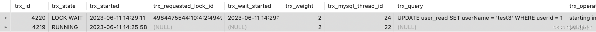
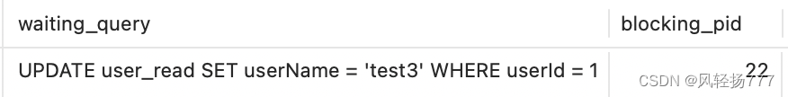
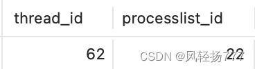
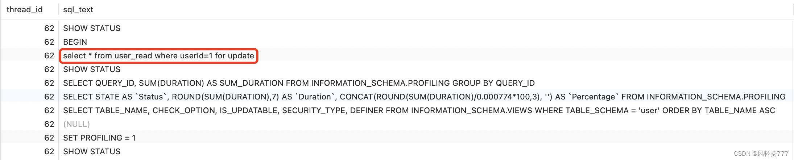

# mysql8查看大事务

### 文章目录

*   *   [1、查看大事务的原因](#1_1)
    *   [2、构建测试数据](#2_5)
    *   [3、模拟大事务场景](#3_22)
    *   [4、查询mysql的事务](#4mysql_43)
    *   [5、查询大事务的详情](#5_59)

## 1、查看大事务的原因

大事务的特点是执行时间长，长期占有锁不释放，导致其他想操作同一行数据的线程阻塞，如果客户端设置了超时时间，超时后，客户端进行重试，又会申请一个mysql线程，然后再阻塞，最终会造成整个mysql库的线程枯竭，整个mysql库不可用，危害极大。  
所以，对于开发人员来说，非常有必要知道如何查看长事务，如何终止掉大事务。

## 2、构建测试数据

很简单，就搞一张表，一个主键，一个业务字段。[DDL语句](https://so.csdn.net/so/search?q=DDL%E8%AF%AD%E5%8F%A5&spm=1001.2101.3001.7020)如下

```bash
CREATE TABLE `user_read`  (
  `userId` int NOT NULL,
  `userName` varchar(12) CHARACTER SET utf8mb4 COLLATE utf8mb4_0900_ai_ci NOT NULL,
  PRIMARY KEY (`userId`) USING BTREE
) ENGINE = InnoDB CHARACTER SET = utf8mb4 COLLATE = utf8mb4_0900_ai_ci ROW_FORMAT = Dynamic;
```

再搞两条测试数据

```bash
INSERT INTO `user`.`user_read` (`userId`, `userName`) VALUES (1, 'test1');
INSERT INTO `user`.`user_read` (`userId`, `userName`) VALUES (2, 'test2');
```

## 3、模拟大事务场景

1)、修改事务超时时间  
默认的事务超时时间是50秒，不便于我们拍查问题，所以我们可以根据以下[sql修改](https://so.csdn.net/so/search?q=sql%E4%BF%AE%E6%94%B9&spm=1001.2101.3001.7020)事务的默认超时时间。注意：修改后，需要关闭当前的mysql连接，重新登录mysql才能生效。

```bash
#单位是秒,默认值是50秒
set global innodb_lock_wait_timeout=5000;
```

2)、开一个会话A，执行以下sql，模拟大事务  
我们手动构建一个加了排他锁的查询语句，只开启事务，不提交语句

```bash
BEGIN;
select * from user_read where userId=1 for update;
```

因为加了排他锁，执行完语句后，不提交事务，所以这就模拟了一个大事务的请求。  
3)、再开一个会话B，执行以下sql，模拟并发的请求

```bash
UPDATE user_read SET userName = 'test3' WHERE userId = 1;
```

此时，因为行锁未释放，所以这条语句会阻塞住。这条语句就是模拟：在大事务存在的情况下，其他请求是不能操作同一行数据的。这样做，明显会影响数据库的并发性能。

## 4、查询mysql的事务

1)、首先查看一下目前数据库中存在哪些事务

```bash
SELECT * FROM information_schema.INNODB_TRX
```

结果如下图：  
  
2)、解读一下这两条记录  
可以看到目前库中有2个事务，事务id分别是：4220、4219。  
4219事务的执行状态是RUNNING、4220事务的执行状态是LOCK\_WAIT。  
RUNNING的意思是：当前事务正在执行。也就是我们在会话A中手动构建的那个大事务。虽然sql已经执行完，但是我们没有提交事务，所以INNODB\_TRX表中就还能查到这个事务。但是因为sql语句已经执行完了，所以trx\_query字段就没有信息了。  
LOCK\_WAIT的意思是：当前事务在等待锁，也就是我们在会话B中手动构建的update语句。因为这个事务还在等待锁，所以update语句并没有执行，所以trx\_query字段能查询到当前待执行的sql语句。

3)、阶段性的排查结论  
通过以上排查，我们已经知道了目前数据库中存在正在执行的大事务，并且还知道已经出现了锁等待的情况。此刻，我们迫切想要知道的是这个大事务的sql是啥，能不能kill掉。但是因为大事务已经执行了sql语句，所以trx\_query中没有了sql信息。所以我们要通过mysql的其他表查询这个大事务的详情，尤其是大事务的sql语句，进而知道是在做什么业务。

## 5、查询大事务的详情

1)、查看哪些事务被阻塞了，被谁阻塞了

```bash
select * from sys.innodb_lock_waits;
```

结果  
  
可以看到有一条UPDATE语句被阻塞了，阻塞者的id是22，这个id是22的事务就是我们排查的目标。接下来就是根据这个22继续查找详细信息。

2)、查询执行大事务的mysql线程id

```bash
select thread_id,processlist_id from performance_schema.threads where processlist_id=22;
```

结果：  
  
得到了执行大事务的线程id，接下来用这个线程id查询大事务对应的sql。  
3)、查询大事务的sql信息

```bash
select thread_id,sql_text from performance_schema.events_statements_history where thread_id=62;
```

结果:  
  
至此，我们就得到了大事务的sql语句，接下来，可以根据sql语句对应一下业务模块，进而得出这个大事务能不能kill。如果确定可以kill，我们可以使用以下语句kill掉这个大事务

```bash
kill 22
```

注意：这个语句要在mysql的sql窗口执行，不是在linux服务器中执行。

参考：  
https://www.51cto.com/article/743732.html
