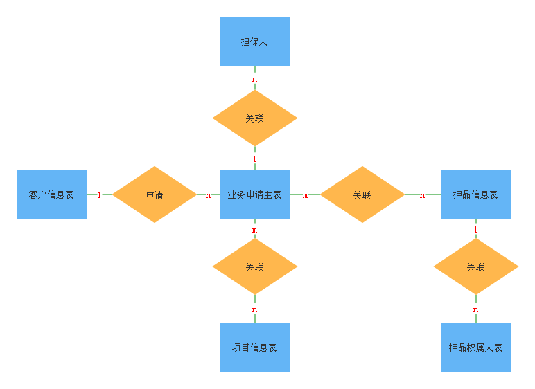
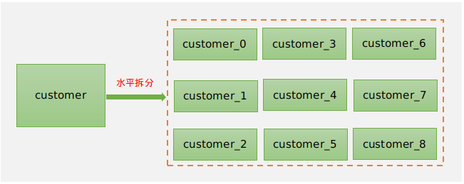
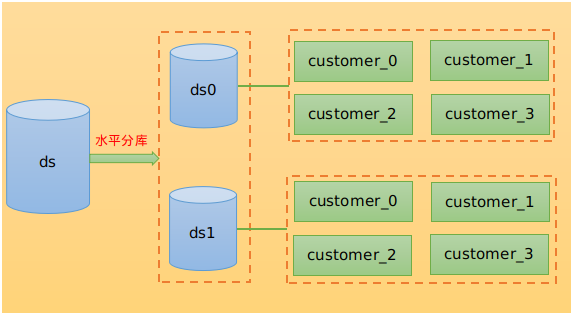
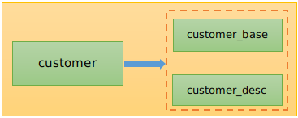
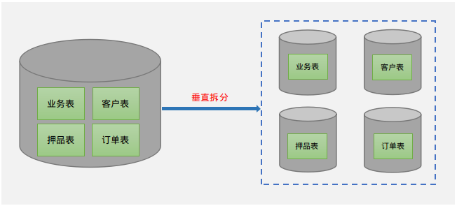
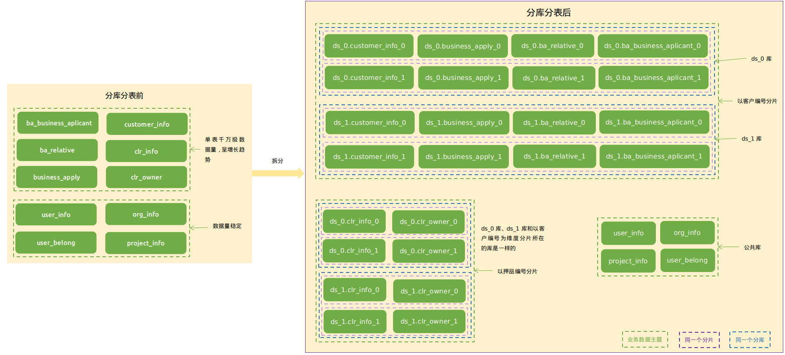
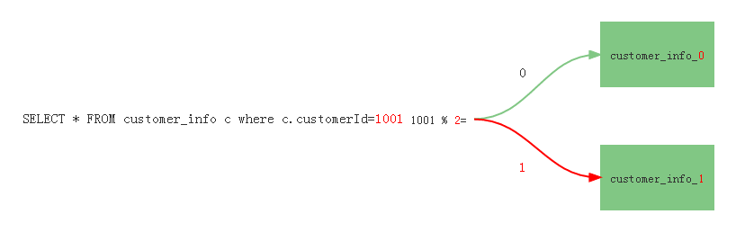
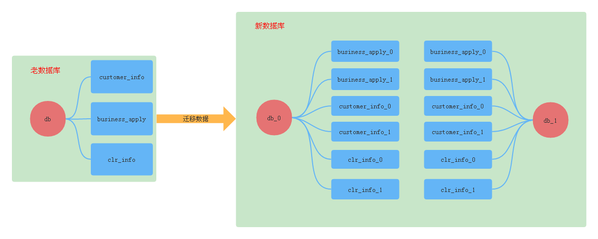
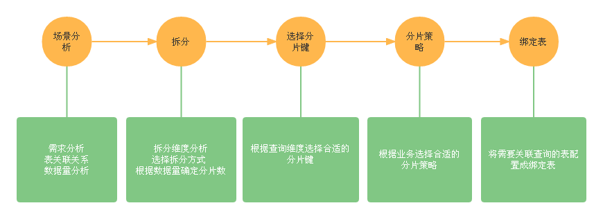

# 基于数据库中间件shardingjdbc的千万级数据分库分表

## 简介

随着公司业务量增长迅速，数据呈线性增长趋势，导致数据量达到了千万级甚至亿级，这时候可能会面临单库存储瓶颈问题和单表查询效率问题，简单的读写分离以及缓存已经无法满足这样的业务场景，鉴于客户对技术方面的要求，这时就不得不考虑采用分库分表解决该问题。本篇文章主要讲解千万级数据量的分库分表解决方案和落地实战。文章会结合真实的业务场景阐述分库分表解决方案，以及分库分表后带来的各种问题并给出建议的解决方案，最后讲解开源中间件shardingjdbc的使用和相关注意事项。

## 一、业务分析

本节主要介绍一个真实的业务场景以及该业务场景目前面临的问题，通过并分析问题产生的原因和各个表的数据量。

## 1.1 业务场景

有这样一个关于授信申请的业务场景，每个客户可以申请一笔或多笔业务，每笔业务申请可以关联一个或多个担保人；申请的业务类型有押品、合作项目；一笔业务可以关联多个押品、合作项目；每件押品和每个合作项目都可以关联多个业务；一件押品可以关联一个或多个权属人，授信申请的ER图如图1-1所示。由于公司业务量增长迅速，导致数据存储量和查询频率都变得很大，再加上系统只有一个数据库节点，所有的表都存放在一个库中，这时主要面临着以下两个问题：

- 数据读写速度变慢
- 单台数据库的磁盘存储容量出现了瓶颈



<div align="center">图1-1 业务ER图</div>

授信申请场景主要涉及到的表结构如下所示，由于篇幅关系，只给出了表中比较核心的字段。

1.客户信息表（customer_info）

| 序号  | 字段  | 名称  | 是否主键 |
| --- | --- | --- | --- |
| 1   | customerId | 客户编号 | 是   |
| 2   | customerName | 客户名称 |     |
| 3   | certType | 证件类型 |     |
| 4   | certId | 法人证件号 |     |
| 5   | status | 客户状态 |     |
| 6   | inputOrgId | 录入组织编号 |     |
| 7   | inputUserId | 录入用户编号 |     |

2.业务申请主表（business_apply）

| 序号  | 字段  | 名称  | 是否主键 |
| --- | --- | --- | --- |
| 1   | serialno | 流水号 | 是   |
| 2   | customerid | 客户编号 |     |
| 3   | customername | 客户名称 |     |
| 4   | applytype | 申请类型 |     |
| 5   | businessAmount | 申请金额 |     |
| 6   | currency | 币种（人民币 美元） |     |
| 7   | corpOrgId | 法人机构号 |     |
| 8   | operateUserId | 经办人 |     |
| 9   | operateOrgId | 经办机构 |     |
| 10  | inputDate | 登记日期 |     |

3.担保人信息表（ba_business_aplicant）

| 序号  | 字段  | 名称  | 是否主键 |
| --- | --- | --- | --- |
| 1   | serialno | 流水号 | 是   |
| 2   | objectNo | 对象编号 |     |
| 3   | objectType | 对象类型 |     |
| 4   | applicantId | 申请人编号 |     |
| 5   | applicantName | 申请人名称 |     |

4.押品信息表（clr_info）

| 序号  | 字段  | 名称  | 是否主键 |
| --- | --- | --- | --- |
| 1   | clrId | 押品编号 | 是   |
| 2   | clrName | 押品名称 |     |
| 3   | clrInfoStatus | 押品信息状态 |     |
| 4   | clrEvalValue | 最新评估价值 |     |
| 5   | businessId | 业务标识 |     |
| 6   | inputUserId | 录入用户 |     |
| 7   | inputOrgId | 录入组织 |     |

5.合作项目表（project_info）

| 序号  | 字段  | 名称  | 是否主键 |
| --- | --- | --- | --- |
| 1   | projectId | 项目编号 | 是   |
| 2   | projectName | 项目名称 |     |

6.业务关联表（ba_relative）

| 序号  | 字段  | 名称  | 是否主键 |
| --- | --- | --- | --- |
| 1   | serialno | 流水号 | 是   |
| 2   | objectNo | 对象编号 |     |
| 2   | objectType | 对象类型 |     |
| 4   | creditSerialNo | 业务主表编号 |     |
| 5   | relativeSum | 关联金额 |     |
| 6   | corpOrgId | 法人机构号 |     |

7.押品权属人表(clr_owner)

| 序号  | 字段  | 名称  | 是否主键 |
| --- | --- | --- | --- |
| 1   | serialno | 流水号 | 是   |
| 2   | clrId | 押品编号 |     |
| 3   | clrOwnerType | 权属人类型 |     |
| 4   | clrOwnerId | 权属人编号 |     |
| 5   | clrOwnerName | 权属人 |     |

## 1.2 数据量分析

上面各个表的数据量分析以及增长趋势如下表所示。

| 序号  | 表名  | 数量级 | 趋势  |
| --- | --- | --- | --- |
| 1   | 业务申请主表(business_apply) | 千万级（2千万以上） | <span style="color: red;">线性增长</span> |
| 2   | 客户信息表(customer_info) | 千万级（2千万以上） | <span style="color: red;">线性增长</span> |
| 3   | 押品信息表(clr_info) | 百万级（3百万以上） | <span style="color: red;">线性增长</span> |
| 4   | 担保人表(ba_business_aplicant) | 百万以上 | <span style="color: red;">线性增长</span> |
| 5   | 业务关联表(ba_relative) | 千万级（3千万） | <span style="color: red;">线性增长</span> |
| 6   | 押品权属人表(clr_owner) | 百万级（3百万以上） | <span style="color: red;">线性增长</span> |
| 7   | 合作项目表(project_info) | 万级  | 稳定  |
| 8   | 用户信息表(user_info) |     | 稳定  |
| 9   | 组织信息表(org_info) |     | 稳定  |
| 10  | 用户关联表(user_belong) |     | 稳定  |

## 1.3 性能问题分析

上文提到，授信申请业务场景面临查询效率和存储瓶颈问题，那么导致此问题出现的具体原因是什么呢？主要有以下几点。

| 序号  | 原因分析 |
| --- | --- |
| 1   | 数据量达到几千万后，MySQL B+树高度会变高，进而出现磁盘IO次数的增加，最终导致查询速度变低 |
| 2   | 业务量增多，添加和更新频率伴随着也升高，锁表的次数增加，等待时间变长 |
| 3   | 关联查询时，由于每张表的数据量都很大，达到中间表内存限制以后就会出现刷盘操作，从而增加IO次数，查询性能变低 |
| 4   | 数据量的增加，单台数据库服务器的磁盘容量出现了瓶颈 |

总结：<span style="color: green;">我们现在常用的传统数据库有Mysql、Oracle、DB2，其中Mysql单表最大承载数据量2000万左右， Oracle和DB单表最大承载数据量能到亿级。上述业务场景只是主业务表的数据量，其附属业务表，比如还款计划、还款明细等表数据的数据量基本上是主业务的表的十几倍，轻轻松松数据量上亿。为了支持这种数据量的应用场景，我们可以考虑分布式数据库，或者使用分库分表的设计思路。</span>


* * *

## 二、分库分表解决方案

在前面性能分析时说到，解决这种大数据量的场景除了有分库分表解决方案，还有分布式数据库，由于客户对技术选型方面有要求，所以本篇文章主要讲解如何使用分库分表解决授信申请场景所面临的问题，下面会结合当前业务场景介绍分库分表的理论知识和常见问题的解决方案。

## 2.1 如何拆分库和表

​ 分库分表常见的拆分方式主要有两种，分别是垂直拆分和水平拆分，二者各有利弊，在选择时需要结合自己的业务场景综合考虑，下面介绍两种拆分方式的原理和各自的优缺点。

### 2.1.1 水平拆分

水平拆分，简单来说就是增加表或库的数量，每张表结构都相同。水平拆分主要的优点是不会影响系统原来的架构，拆分后可以提高单表查询速度，但是会有数据迁移的问题。

1.  水平分表的效果如图2-1所示。



<div align="center">图2-1 水平分表效果图</div>

2. 水平分库效果如图2-2所示。



<div align="center">图2-2 水平分库效果图</div>

### 2.1.2 垂直拆分

垂直分库，原理是按业务将相同业务表单独放在一个数据库中，也就是专库专用，垂直分表原理是大表拆小表，也就是将表中一些文本字段内容较大的表拆分成一张子表。垂直拆分的优点是逻辑比较清晰，但拆分后关联查询时会存在全局事务；其次是拆分不合理会让数据库设计混乱，增加运维和维护的难度。

1.  垂直分表效果如图2-3所示
    
    
    

<div align="center">图2-3 垂直分表效果图</div>

2.  垂直分库效果如图2-4所示。



<div align="center">图2-4 垂直分库效果图</div>

**注意：**专库专用不是说一个库就只有一张表，而是具有相同业务的**表集合**，图2-2中每个分库都只有一张表，其实只要是具有相同业务的表都可以放在一个库中，这里为了方便展示，每个分库只画了一个。

### 2.1.3 授信申请业务拆分案例

上面介绍了互联网上常见的两种分库分表拆分方式，他们都各有利弊，那么当面对复杂的业务场景时，该如何进行选择呢？下面以开篇中提到的授信申请场景为例进行说明。

​        首先我们在拆分时需要要注意的一个问题就是不能单单从一张表的拆分上考虑如何拆分，而是要从全局的角度进行分析。通过上文分析，我们知道在授信申请业务场景中会有多张表做关联查询的情况，为了保证这些需要关联的表都在同一个库中，在这里选择水平拆分的方式进行分库分表，但水平拆分会存在多个库节点的情况，为了让其不跨库，我们需要找到一个维度，让其以该维度产生的数据都落在同一个库节点上，也就是说需要将这些需要关联的表都统一成一个划分维度，通过这种方式，当我们进行关联查询时，以该维度划分的数据都在同一个数据库中，就避免了全局事务、跨库关联等问题。那么，这个所谓的维度我们该如何选择呢？

​        在选择维度时，不能进行随意地选择，而是要先了解每个业务对象涉及的数据表在业务系统中的使用群体是谁以及该业务对象的服务对象是谁，下面我们来看一个例子。

​       例如在贷款业务申请场景中，客户可以通过C端发起申请，也可以通过提交资料到客户经理，由客户经理通过PC端管理功能进行贷款申请。如何进行分库,应该根据自己的业务逻辑进行拆分。其实互联网企业都是按照自身主要服务对象进行数据拆分的,那么我们的应用系统(信贷、个贷)的主要服务对象是谁呢?当然是信贷授信融资个人和企业,就是金融的机构的客户。当然也有人说我们主要是给金融机构内部人员进行业务操作服务的,所以我们应用系统的主要服务对象应该是这些人才对。如果在10年以前我们认为应用系统的主要服务对象是金融机构内部人员,还是可以理解的,因为那个时候金融机构本身将信贷、个贷系统提供给电子银行渠道的接口几乎没有。你在看看现在的那个金融机构的系统中没有几十或上百个服务接口的,有的金融机构百万级客户数量,每日能产生几十万的查询请求(这还是没有接入互联网渠道业务之前的)。而金融机构内部人员在系统中进行的操作数量远远低于这个量级。随着多数系统功能的自动化智能化,需要人工操作的地方也会越来越少。基于以上原因,我们按照金融机构服务客户为维度来进行水平分库（但这不是绝对的，因为还有可能存在农信社下多个子公司的情况，对于这种就需要考虑两个维度，第一维度是子公司的机构号，第二维度才是客户，所以在拆分的过程中需要结合当下的企业架构） 。

通过上面贷款业务申请场景案例，我们已知道该如何为需要关联的表选择一个统一的拆分维度，在这里得说明一下，对于多对多关系的表来说需要单独考虑，例如在授信申请场景中，业务申请主表(business_apply)和押品表(clr_info)就是多对多的关系，所以我们可以将押品表以押品编号拆分，不和业务主表关联的表统一在一个维度上，当我们需要和客户为维度分片的表做关联查询时，由于有业务关联表(ba_relative)，因此可以先通过业务关联表查询出押品编号，再通过押品编号去以押品为维度拆分的表查询，最后在内存汇总得到最终的结果集。除此之外，还有一个问题就是押品表虽然和业务主表是多对多的关系，不能作为一个维度，但是押品表和押品权属人表却不是多对多的关系，他们之间也会进行关联查询，所以我们就可以将押品表和押品权属人表以押品为维度进行拆分，所以本文介绍的场景只是给出一个拆分的方法论，在面对其他场景时也万变不离其中。

​ 分库分表主要是针对呈线性增长的那一部分大数据量表，但在系统中，还存在一类表数据比较稳定，数据量最终也不会达到很高，例如一些字典表，配置表等，这一部分表是不需要拆分的，那么我们该如何处理这一类表呢？目前主要提供两种解决方案。第一种方案是将其在每一个分库中都原样保存一份，这样，如果业务表需要和这些表做关联时就不需要跨库了，但这种处理方式在数据库设计上不是很规范，还存在空间浪费情况，而且在更新公共表时需要全部更新，会带来全局事务问题，可控性差；而第二种方案是将这些表都放在一个公共的数据库中，关联查询时，通过远程接口调用在内存汇总得到结果集。这两种方式其实都各有利弊，综合以最优的选择来看，还是建议将其放在一个公共数据库中。图2-5是授信申请业务场景经过水平拆分后的效果图，在下文会讲解该图的含义。



<div align="center">图2-5 水平拆分结果图</div>

​ 在前面介绍中，为了解决跨库关联等问题，我们选择水平拆分的方式，然后再通过一个统一的维度保证一次关联查询只进一个分片库，紧接着通过一个贷款业务申请场景说明了如何为关联的表选择一个统一的分片维度。那么，我们为什么不选择垂直拆分呢？

​ 首先，垂直拆分虽然解决了存储瓶颈，但是不能从根本上解决查询效率问题，其次是存在跨库关联查询问题，而目前还没有可以解决跨库关联查询的问题开源中间件，其次，也许有人会觉得可以通过单表查询，然后在内存中对各个表的查询结果进行汇总从而避免跨库关联问题，这种方式当然可以，但是，我们在解决某个问题的同时也需要考虑是否在解决该问题后是否又会出现新的疑难问题，因为授信申请业务中关联的表较多，如果都垂直拆分的话，就会让数据库设计变得很零碎，除了改变系统的架构外，还会增加运维和维护的难度，得不偿失，因此，我们在选择一种解决方案时不能一概而论，需要从全局考虑，选择最优的一种方案。

## 2.2 分片键的选择

在原始的单库单表中，通过主键即可查询到一条唯一的记录，但是分库分表后会存在多个分片，为了在查询时能够确定数据在那一个分片上，就需要选择一个字段作为分片键，并在该字段上制定路由规则，查询的时候通过分片键查询。

### 2.2.1 选择合适的分片键

分片键的选择，一般采取的方案是按照查询维度去选择，一般选择具有唯一性的<span style="color: red;">主键</span>作为分片键。例如，在本文提及的业务场景中，客户信息表的分片键会选择客户编号(customerId)。

但是有的表具有<span style="color: red;">多个查询维度</span>，比如业务申请主表(business_apply)中就有流水号(serialno)和客户编号(customerId)两个查询维度,如果我们以客户查询维度分片，当我们再用另一个查询维度业务流水号(serialno)去查询的时候就会出现非分片键查询问题，导致全路由影响查询效率，这种情况该如何解决呢？

一种解决方案是将业务流水号(serialno)和客户编号(customerId)统一成一个分片维度，这样做查询时，不管用那一个维度查询都能保证落到同一个分片上。

### 2.2.2 分片算法

<span style="color: #409eff;">（1）取模</span>

取模分片算法就是将分片键的值与分片总数进行取模，取模后得到的值就是分片节点的编号。例如，我们将客户信息表(customer_info)拆分成两个分片后就得到物理表customer_info_0和customer_info_1，对应的编号就是[0,1],分片总数是2。执行过程如图2-6所示。



<div align="center">图2-6 取模分片执行过程</div>

虽然取模分片算法使用简单，但是<span style="color: red;">后期不易扩容</span>且<span style="color: red;">扩容后会存在大量数据迁移的问题</span>。在图2-5中客户信息表原来有两个分片，由于业务需要，现在又增加一个分片customer_info_2,分片总数变成了3，此时就需要对3取模。如下所示，现在我们再用客户编号1001对3取模，发现得到值是2，然后去编号为2的表customer_info_2查询就会发现查询不到该记录，所以扩容后就需要将客户编号1001对应的记录从customer_info_1迁移到customer_info_2上。因为这些表中的数据量都是千万级，所以数据迁移是一个非常大的工作量。那么我们该如何解决呢？

<div align="center">1001 % 2 = 1 1001 % <span style="color: red;">3</span> = <span style="color: red;">2</span></div>

为了解决取模分片策略带来的扩容和迁移问题，这里建议，如果要使用取模分片策略，那就提前<span style="color: red;">做好对未来几年数据量的最大预估，一次性将库和表的分片分好，后期不再进行扩容，也不会造成数据迁移问题</span>。

<span style="color: #409eff;">（2）基因法</span>

这里所说的基因法，是指在业务流水号的前面追加两位基因（可以有多位，根据业务场景选择），我们规定第一位表示库的编号，第二位表示表的编号，他们的值都在[0-9]之间，所以只需要两位我们就可以得到10个库和每个库10张表，全部加起来就是100张表，基本上是可以满足大多数业务场景了。

<div align="center"><span style="color: red; font-size: medium;">1</span><span style="color: green; font-size: medium;">0</span>20221215792315 <span style="color: red; font-size: medium;">1</span><span style="color: green; font-size: medium;">1</span>20221215792332 <span style="color: red; font-size: medium;">0</span><span style="color: green; font-size: medium;">0</span>20221215798976 <span style="color: red; font-size: medium;">0</span><span style="color: green; font-size: medium;">1</span>20221215794689</div>    基因法分片基本上是解决了扩容和数据迁移问题，使用基因法分片，不需要进行数据迁移，而且扩容也是可以任意扩充，使用起来非常灵活。下面我们来看一下它是如何解决扩容和无数据迁移的。

- <span style="color: red;">基因法是如何解决扩容问题的？</span>

使用基因法这种思想分片是可以实现无限扩容的，使用它分片生成的主键格式为：<kbd>库编号</kbd>+<kbd>表编号</kbd>+<kbd>业务流水号</kbd>，路由的时候直接截取前两位就可以得到一个真实的节点，它不会像取模分片那样，只要<span style="color: red;">模值</span>发生改变，就会导致路由不到以前的存量数据，所以，基因法很好地解决了扩容问题题，扩容时只需要增加节点即可。

- <span style="color: red;">基因法如何解决数据迁移问题？</span>

首先说明一下，这里所说的数据指的是<span style="color: red;">存量数据</span>和<span style="color: red;">增量数据</span>，使用基因法分片不需要进行数据迁移。因为基因法扩容以后是不会影响到真实的节点的路由规则，而取模就不一样了，取模需要在路由的时候将分片键与模值（库或表的总数）进行计算，然后得到一个真实的节点，模值改变，那么真实节点就改变了，所以扩容后就需要将受到影响的记录进行迁移。

- <span style="color: red;">基因法分片的数据均匀吗？</span>

这里说明一下，通过基因法分片后，主键生成算法是需要由用户去实现的，所以要让每一个分片中的数据都均匀分布，那就取决于用户实现的主键生成算法。

各种分片算法对比：

| 序号  | 分片算法 | 优点  | 缺点  | 应用场景 |
| --- | --- | --- | --- | --- |
| 1   | 取模  | 数据分布均匀，使用简单 | 不易扩容、数据迁移问题 | 数据稳定，后期无需扩容的场景 |
| 2   | 基因法 | 易扩容，扩容后无须数据迁移 | 主键生成难度高 | 应对业务复杂度高的场景 |

## 2.3 分库分表后带来的问题

虽然说，分库分表解决了千万数据量的存储和查询问题，但在受益的同时也带来了一些问题，本小结将着重介绍分库分表后带来的数据迁移、分布式主键、后期扩容、跨库关联查询几个问题。

### 2.3.1 数据迁移

数据迁移有老系统的数据迁移以及`分库分表后`的存量数据和增量数据的迁移，下面来看一些这两种迁移方式会遇到的问题。

<span style="color: #409eff;">（1）分库分表后的数据迁移问题</span>

<span style="color: red;">存量数据</span>是迁移之前就存在的数据，而造成存量数据迁移的原因是经过扩容以后造成了路由不正确问题，也就是不能通过分片键正确地找到数据，典型的案例就是采用取模分片策略造成的数据迁移问题。

<span style="color: red;">增量数据</span>是迁移存量数据过程中产生的新数据，如果迁移过程是在生产环境中进行的，那么迁移过程中还会产生增量数据，对于这一部分数据也要进行迁移，所以会造成恶性循环，一种解决方案就是迁移过程在停机的状态下进行，这样在迁移存量数据的过程中就不会产生增量数据。

<span style="color: #409eff;">（2）老数据迁移问题</span>

在做了分库分表以后，我们需要将原来老系统中的数据迁移到分库分表后的数据库中，老数据迁移如图2-7所示，这时就会遇到一个问题，那就是老系统中没有分片键，如果用主键作为分片键，那它也是没有规则的。从图2-5可以看出原来的单库单表被拆分成了多库多表，没有分片键是不能正确地操作分库分表中的数据的。

也许有人会认为，竟然老系统表中的主键没有分片规则，那重新将主键改成有规则的不就解决了吗？但是<span style="color: red;">这些主键已经关联了很多的业务</span>，如果修改将造成巨大的灾难，显然这种做法显然行不通。一种解决方案是单独做一张分片键与主键的缓存映射表，将分片键和业务主键做关联，查询的时候，通过主键拿到分片键得到路由节点。

<div align="center"></div><div align="center">图2-7 老数据迁移图</div>

### 2.3.2 分布式主键

在单库单表场景中，可以使用自增ID作为主键，但是分库分表以后就不能采用这种方式了，因为会存在多个分片ID相同的情况，如果一定要使用自增ID，一种解决方案是单独用一张公共表生成，但是如果数据量过多，也会造成这张表变得很大。比较好的解决方案就是采用<span style="color: red;">雪花算法</span>或者<span style="color: red;">UUID</span>生成唯一的主键，此外也可以使用公司自己的主键规则。

### 2.3.3 分布式事务

分库以后，由于数据分布在多个库节点上，就不能像控制单库那样保证事物的原子性，所以，为了避免全局事务问题，我们建议，在设计分库分表时将需要做关联的表的数据存放在同一个数据库，这样不仅可以解决跨库join问题也避免了全局事务。

### 2.3.4 跨库关联查询

分库分表后带来的另一重大问题就是跨库关联查询(join)问题，下面是跨库关联查询的几个问题。

（1）在做关联查询的时候，如果where条件中有分片键，那么本次查询只会进入满足分片键规则的数据库，不会再出库和其他表做笛卡尔积，导致本次查询错误。例如下面一个SQL：

```sql
SELECT * FROM A a,B b WHERE a.bid=b.bid AND a.bid='1020221215792315'
```

说明一下，这里采用的是基因法分片策略，用两位表示，其中第一位是库基因，第二位是表基因。上面SQL中编号为1020221215792315的数就在1库0表中，所以它只会进入1库0表的分片中。（A表和B表都被水平拆分成了多个库和多个表）

针对这个问题的解决方案是：<span style="color: red;">凡是需要做关联查询的表，分库规则都要一样，将它们绑定在一起，保证他们的数据都落在同一个库中</span>，这样就不会造成跨库问题了，在shardingjdbc中将这些需要关联查询的表配置成绑定表，就可以避免笛卡尔积查询，从而提高查询效率。

### 2.4.5 小结

在本节中介绍了如何选择合适的分片键、常用的分片算法以及分库分表后带来的各种问题。在当前业务场景中针对这些问题给出的建议是选择<span style="color: red;">基因法分片策略</span>进行分片，避免分库分表后的扩容和数据迁移问题；选择<span style="color: red;">主键</span>作为分片键，而对于查询维度有多个的，可以将其统一成一个维度作为<span style="color: red;">复合键</span>；需要做关联查询的表，让他们的<span style="color: red;">分片规则都保持一致</span>，保证都在同一个库中，避免全局事务和跨库关联问题。

## 2.4 本章小结

通过本章的分库分表理论介绍，在我们当前的业务场景中，最优的拆分方式是水平拆分，不选择垂直拆分原因是会增加系统的复杂度；选择分片键时一般选择具有唯一性的主键，对于有多个查询维度的我们可以将其作为复合分片键；在所以分片策略中，最优的分片策略是基因法，他主要是易扩容，而且扩容后不会造成数据迁移；为了避免跨库关联查询，我们可以按照某个维度将其与之关联的数据都落在同一个库中。

* * *

## 三、基于Shardingjdbc的分库分表案例

在前面的章节中介绍了分库分表的理论知识以及需要注意的问题，本章主要完成分库分表案例的落地和介绍shardingjdbc中间件在使用时需要主要的问题。

## 3.1 分库分表案例



（1）通过开篇中的数据量分析可知客户信息表、业务申请主表、担保人表、押品权属人表、业务关联表、押品表的数据量都达到了千万级别，所以我们不得不对其做拆分。

（2）拆分方式我们选择的是水平拆分，因为会涉及到业务申请主表、客户信息表、担保人表业务关联表的关联查询，所以需要保证以客户为维度产生的数据都落在同一个库里。而押品信息表和业务主表是多对多的关系，不需要和他们保持同一个维度，我们将其以押品编号分片，押品信息表和权属人表是一对多的关系，按照前文分析，我们将押品和权属人统一成一个维度。

（3）对于用户信息表(user_info)、组织信息表(org_info)、用户关联表(user_belong)、合作项目表(project_info)，我们将其存放在一个公共库中，涉及到和其他业务关联时，通过接口调用，在内存中进行组装得到结果。

（4）在shardingjdbc中，为了避免笛卡尔积查询，我们将需要进行关联的表配置成绑定表，从而提高查询效率，而客户信息表、业务申请主表、担保人、业务关联表是需要关联的，所以我们将其作为绑定表，还有就是以押品编号为分片维度的押品表和权属人表，也将其进行单独绑定，，配置结果如下所示：

```yml
spring:
  shardingsphere:
    rules:
      sharding:
        binding-tables:
          - ba_business_applicant,customer_info,business_apply,ba_relative
          - clr_info,clr_owner
```

（4）    拆分完成以后就需要选择分片键，选择的时候需要清楚这张表具有那些查询维度，这样在查询的时候就可以通过分片键查询，提高查询效率，例如在客户信息表中只有一个查询维度客户编号(customerId)，所以我们将customerId作为分片键，而在业务申请主表(business_apply)中具有两个查询维度，业务流水号(serialno)和客户编号(customerId)，所以我们将他们作为复合分片键，对于其他表的选择也同理。下面是各个表的分片键选择：

| 序号  | 表名  | 分片键 |
| --- | --- | --- |
| 1   | 客户信息表(customer_info) | 客户编号(customerId) |
| 2   | 业务申请主表(business_apply) | 业务流水号(serialno)、客户编号(customerId) |
| 3   | 担保人表(ba_business_aplicant) | 对象编号(objectNo) |
| 4   | 押品信息表(clr_info) | 押品编号(clrId) |
| 5   | 业务关联表(ba_relative) | 业务流水号(creditSerialNo) |
| 6   | 押品权属人表(clr_owner) | 押品编号(clrId) |

（5）    为了避免分库分表后带来的一些问题，我们选择基因法分片策略。在shardingjdbc是没有提供基因法分片策略的，但我们可以通过它提供的SPI接口自己去实现，下面是实现的基于基因法的单字段和多字段分片算法。下面是<span style="color: red;">基因法</span>分片算法的使用

- 单字段分片策略

```yml
spring:
  shardingsphere:
    rules:
      sharding:
        sharding-algorithms:
          common-database: #算法的名字，自定义
            props:
              type: database #分片类型：table、database
              allow-range-query-with-inline-sharding: true #是否允许范围查询，默认是false
            type: factor-standard #算法的类型 标准分片算法 单字段
```

- 复合字段分片策略

```yml
spring:
  shardingsphere:
    rules:
      sharding:
        sharding-algorithms:
          complex-db: #算法的名字，自定义
            props: #属性
              type: database # 分片类型：table、database
              allow-range-query-with-inline-sharding: true #是否允许范围查询，默认是false
            type: factor-complex #算法的类型 复合分片算法 多字段

```

提示：上面两种分片算法类型中，属性类型里面都有database、table两个选择，如果是用于对库的分片就填database,对表分片就条table。

基因分片策略的实现原理：在这个业务场景中，基因法采用两位表示，第一位为库编号，第二位为表编号，在路由的时候，截取出前两位就可以得到库和表编号，然后将其拼接到逻辑库或逻辑表后面就可以得到一个真实的物理节点，所以在命名的时候需要注意逻辑库和逻辑表的命名规范。

<div align="center"><kbd>分片键(主键)</kbd> = <kbd>库基因</kbd> + <kbd>表基因</kbd> + <kbd>业务流水号</kbd> <span style="color: red;">基因法分片策略注意事项如下：</span></div>

- 逻辑库的命名规范为：名称_编号[0-9]。例如 ds-0,ds-1, ...
- 物理表的命名规范：表名称_编号[0-9]。例如 customer_info_0、customer_info_1, ...

（6）拆分结果

为了解释方便，我们将上文中图2-5的分库分表拆分图再放一遍。如下图所示。


<div align="center">图3-2 分库分表拆分图</div>

图中绿色部分表示业务对象，例如我们这个业务场景中业务对象就是授信申请；蓝色框内表示同一个分库，表示框内的这些表分片都是在同一个数据库。另外图中以客户编号和押品编号分片的两种分片规则中ds_0、ds_1库是同一个。

从上图可以看出，分库分表后，被分成了两个部分，一部分是公共库，另一部分则通过两个维度进行了分片，分别是客户编号和押品编号维度。在授信申请中，客户信息表、业务申请主表、业务关联表、担保人表之间会发生关联查询，因此将其统一到以客户编号为维度分片；还有就是押品和权属人是一对多的关系，也会发生关联，因此将其统一成以押品编号为维度分片。而业务申请主表和押品表因为是多对多的关系，在查询的时候，通过业务关联表查询出押品编号，再去押品分片做单表查询，在内存中进行结果汇总。

图中紫色框表示同一个分片，在以客户编号分片的分库分表中就有4组分片，也就是一次SQL操作只会路由到其中一组上面。例如，下面有一个通过客户编号查询客户的业务申请信息的查询，这时就会去1库0表这个分片上查询，因为业务表和客户信息表都是以客户编号为维度分片的，所以他们所关联的数据都在同一个数据库中，所以就不会出现shardingjdbc通过分片键查询时无法跨库关联导致查询结果不正确问题。

```sql
select * from business_apply bis inner join customer_info c on bis.customerId=c.customerId  where c.customer_id=1020220215001
```

添加一条业务申请时，只需要让他们的分片键的分片规则和客户编号保持一致即可，例如现在一个客户要申请一笔业务，客户的编号是<span style="color: red;">10</span>20220215001，所在分片就是1库0表，然后我们在生成业务申请表的分片键的时候，让它的分片键和客户信息表的分片键保持一致，业务申请表编号可以是<span style="color: red;">10</span>20230323003，如果客户的分片键是1库1表，那么业务信息表的分片键也是1库1表，这样就保证了只要是该客户产生的业务申请记录都是在同一个分片中。

## 3.3 shardingjdbc注意事项

下面是在使用shardingjdbc过程中需要注意的问题。

（1）配置文件中配置的<span style="color: red;">逻辑表</span>名称必须和数据库中的真实表的前缀一样。否则，在多表关联查询时会出现问题。数据库中逻辑表business_apply的真实表名称为business_apply_0、business_apply_1

```yaml
spring:
  shardingsphere:
    rules: #切分规则配置
        tables: #切分的表
          business_apply: #逻辑表名称
            database-strategy:
              complex: #复合分片策略
                sharding-columns: serial_no,customer_id #切分的列
                sharding-algorithm-name: complex-db #分片算法名称
            table-strategy:
              complex: #复合分片策略
                sharding-columns: serial_no,customer_id #切分的列
                sharding-algorithm-name: complex-table #分片算法名称
            actual-data-nodes: ds-$->{1..2}.business_apply_$->{0..1} #真实的数据节点
```

（2）范围查询时，必须在配置文件中手动开启，否则会报异常。开启方式是在算法的属性中配置中将<span style="color: red;">allow-range-query-with-inline-sharding</span>设置为<span style="color: green;">true</span>，默认是false，案例如下：

```yml
spring:
  shardingsphere:
    rules: #切分规则配置
      sharding:
        sharding-algorithms: #分片算法
          complex-db: #分片算法的名称，自定义
            props: #属性
              type: database #切分的对象
              allow-range-query-with-inline-sharding: true #开启全路由查询
            type: factor-complex #分片算法类型
```

（3）中间件不支持游标查询。在使用中间件配置后的库，无论是单库还是多库都是不支持游标操作的，中间件在底层做了限制，只要是游标查询就直接抛异常。异常信息如下：

```shell
## Cause: java.sql.SQLFeatureNotSupportedException: closeOnCompletion
; closeOnCompletion; nested exception is java.sql.SQLFeatureNotSupportedException: closeOnCompletion
```

（4）在中间件的子查询中，不在同库的表是不支持子查询的。例子如下：

<span style="color: green;">正例：</span>

```sql
select * from business_apply bis where bis.serial_no in(select serial_no from business_apply where customer_id=#{customerId})

```

```sql
select * from org_info, (select user_id from user_info) as u
 
select * from  business_apply,(select * from customer_info) as c
```

<span style="color: red;">反例：</span>

```sql
select * from business_apply bis where bis.operate_user_id in(select user_id from user_info)
```

```sql
select * from  business_apply,(select * from user_info) as u
```

说明：user_info和business_apply不在同一个库。

（5）如果两张表或者多张表是绑定表，那么他们的<span style="color: red;">分片规则</span>必须保持一致，否则会报异常。

（6）假如采用的是日期范围分片，那么如果分片键在表达式中时，会导致全路由。例子如下：

```sql
SELECT * FROM customer_info WHERE to_date(create_time, 'yyyy-mm-dd') = '2022-01-01';
```

（7）在分库分表做多表分组查询的时候，如果没有使用order by进行排序，那么中间件会自动以分组关键字作为升序排序重写SQL。列子如下：

```sql
select bis.apply_type from business_apply bis ,customer_info c  where bis.customer_id=c.customer_id group by bis.apply_type
```

执行日志如下：

```sql
: Actual SQL: ds-1 ::: select bis.apply_type from business_apply_0 bis ,customer_info_0 c  where bis.customer_id=c.customer_id group by bis.apply_type ORDER BY bis.apply_type ASC
...
```

（8）在没有通过分片键查询一张表时，如果有多张真实表，最终中间件会将其SQL优化为联合查询（union all）。

（9）<span style="color: red;">在对分库分表进行配置的时候，公共库（不需要进行分库分表的库）的配置只需要配置数据源即可，可以不用进行表结构的配置（也可以配置），中间件会自动识别配置的表结构。</span>

## 3.4 shardingsphere多种运行模式对比

运行模式有三种，分别是shardingsphere-jdbc、shardingsphere-proxy、前两者混合部署。

|            | shardingsphere-jdbc | shardingsphere-proxy |
| ---------- | ------------------- | -------------------- |
| 数据库     | 任意                | MySQL/PostgreSQL     |
| 连接消耗数 | 高                  | 低                   |
| 异构语言   | 仅Java语言          | 任意                 |
| 性能       | 消耗低              | 消耗略高             |
| 无中心化   | 是                  | 否                   | 
| 静态入口   | 否                  | 是                   |

（1）从上表中可以看出shardingsphere-proxy是有中心化的，也就是它没有和应用程序代码`耦合`在一起的，它是作为一个`进程`部署到一个服务器中，这种部署方式的可以支持多种语言，因为它提供了一个静态入口。

（2）第三种运行模式是混合部署，这种是结合前两种模式通过一个统一的`配置中心`进行分片规则的配置，从而实现多种模式一起使用。

## 3.5 shardingsphere 数据加解密

在shardingjdbc中可以通过yml配置的方式给表中的字段进行加密和解密，但在配置时需要注意不同的加密算法可能在查询时得到的值不一样，因为加密算法具有可逆和不可逆，这里通过MD5（不可逆）和AES（可逆）加密算法对比说明，对比如下所示。

1、MD5

- 在`有`原文列的时候，当queryWithCipherColumn=false时，`可以`得到明文值。(MD5)
    
- 在`有`原文列的时候，当queryWithCipherColumn=true时，`可以`得到明文值。(MD5)
    
- 在`没有`原文列的时候，当queryWithCipherColumn=true时，`可以`得到密文值。(MD5)
    
- 在`没有`原文列的时候，当queryWithCipherColumn=false时，`不能查询到值`。(MD5)


2、AES

- 在`有`原文列的时候，当queryWithCipherColumn=false时，`可以`得到明文值。(AES)
- 在`有`原文列的时候，当queryWithCipherColumn=true时，`可以`得到明文值。(AES)
- 在`没有`原文列的时候，当queryWithCipherColumn=true时，`可以`得到明文值。(AES)
- 在`没有`原文列的时候，当queryWithCipherColumn=false时，`不能查询到值`。(AES)

配置案例如下所示，更多细节请查看官方文档5.2.2版本。

```yaml
spring:
  shardingsphere:
    rules:
      encrypt:
        tables:
          customer_info: #表名称
            columns:
              customer_name: #需要加密表字段名称
                queryWithCipherColumn: true #是否可以通过密文列查询
                cipher-column: customer_name #密文列
                encryptor-name: name-encryptor #加密算法
        encryptors:
          name-encryptor: #加密算法名称，自定义
            type: AES #加密算法类型
            props: #属性配置，不同的算法配置也不同
              aes-key-value: abc123456
```

下表是ShardingSphere内置的几种加密算法：

| 序号 | 名称 | 是否可逆 |
| ---- | ---- | -------- |
| 1    | MD5  | 否       |
| 2    | SM3  | 否       |
| 3    | AES  | 是       | 
| 4    | RC4  | 是       |
| 5    | SM4  | 是       |

## 3.5 shardingjdbc对数据库的支持情况

在shardingsphere 5.2.2版本中，支持如下数据库。

- MySQL
- Oracle
- SQLserver
- PostgreSQL

## 总结

本文通过一个授信申请的业务场景引出了千万级数据量的分库分表解决方案，并给出了面对复杂业务场景关联查询的解决方案，然而，分库分表后也会带来很多的问题以及增加系统的复杂度，因此，在不得已的情况下一般不会首先考虑分库分表。
