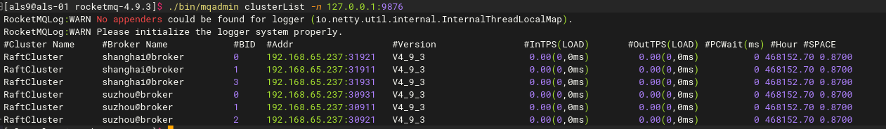
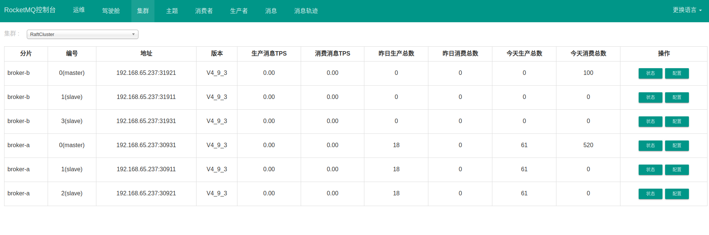

### 前言

本部分主要介绍如何部署自动容灾切换的 RocketMQ-on-DLedger Group。

RocketMQ-on-DLedger Group 是指一组相同名称的 Broker，至少需要 3 个节点，通过 Raft 自动选举出一个 Leader，其余节点 作为
Follower，并在 Leader 和 Follower 之间复制数据以保证高可用。 RocketMQ-on-DLedger Group 能自动容灾切换，并保证数据一致。
RocketMQ-on-DLedger Group 是可以水平扩展的，也即可以部署任意多个 RocketMQ-on-DLedger Group 同时对外提供服务。

### 1. 下载Apache RocketMQ

这里以在Linux环境下利用社区4.9.3的二进制包为例，介绍RocketMQ安装过程。下载地址为：
https://dist.apache.org/repos/dist/release/rocketmq/4.9.3/rocketmq-all-4.9.3-bin-release.zip

解压安装包：

```shell
unzip rocketmq-all-4.9.3-bin-release.zip
```

### 2. 快速部署

```shell
cd rocketmq-all-4.9.3-bin-release
sh bin/dledger/fast-try.sh start
```

如果上面的步骤执行成功，可以通过 mqadmin 运维命令查看集群状态。

```shell
sh bin/mqadmin clusterList -n 127.0.0.1:9876
```



### 3. 双中心DLedger集群搭建

#### 3.1 编写配置

每个 RocketMQ-on-DLedger Group 至少准备三台机器，双中心的话则需要六台机器。 编写 6 个配置文件，建议参考 conf/dledger目录下的配置文件样例。 关键配置介绍：

| name                  | 含义                                                                       | 举例                                                     |
| --------------------- | -------------------------------------------------------------------------- | -------------------------------------------------------- |
| enableDLegerCommitLog | 是否启动DLeger                                                             | true                                                     |
| dLegerGroup           | Dledger Raft Group的名字，建议和brokerName保持一致                         | broker-a                                                 |
| dLegerPeers           | Dledger Group内各节点的端口信息，同一个Group内的各个节点配置必须要保持一致 | n0-127.0.0.1:40911;n1-127.0.0.1:40912;n2-127.0.0.1:40913 |
| dLegerSelfId          | 节点id，必须属于dLegerPeers中的一个，同Group内各个节点要唯一               | n0                                                       |


每个数据中心都需要3份配置文件，以conf/dledger/broker-n0.conf 的配置作为基础，我们将搭建以两个节点组成的nameserver集群以及苏州、上海两个dLegerGroup,
下面分别以两个group中的一个节点的配置为例 ：

苏州：
```properties
## Raft集群名称，所有节点必须一样
brokerClusterName=RaftCluster
## 当前数据中心的broker名称，添加数据中心标识，苏州（suzhou）、上海（shanghai）
brokerName=suzhou@broker
## 监听端口
listenPort=30911
## nameserver地址，多个地址以;分隔
namesrvAddr=192.168.65.237:9876;192.168.65.239:9876
## 数据文件存放目录
storePathRootDir=/tmp/rmqstore/node00
storePathCommitLog=/tmp/rmqstore/node00/commitlog
## 是否启动DLeger
enableDLegerCommitLog=true
## Dledger Raft Group的名字，建议和brokerName保持一致
dLegerGroup=suzhou@broker
## DledgerGroup内各节点端口信息，同一个Group内的各个节点配置必须要保持一致，ip地址根据实际情况修改
dLegerPeers=n0-127.0.0.1:40911;n1-127.0.0.1:40912;n2-127.0.0.1:40913
## 节点id，必须属于dLegerPeers中的一个，同Group内各个节点要唯一
dLegerSelfId=n0
# 发送消息的线程池线程数,建议配置成 Cpu 核数
sendMessageThreadPoolNums=16
# broker的ip地址(如果服务器上存在多网卡的情况,建议手动配置,避免获取不到正确的ip信息)
brokerIP1=192.168.65.237
```

上海：
```properties
## Raft集群名称，所有节点必须一样
brokerClusterName=RaftCluster
## 当前数据中心的broker名称，添加数据中心标识，苏州（suzhou）、上海（shanghai）
brokerName=shanghai@broker
## 监听端口
listenPort=30911
## nameserver地址，多个地址以;分隔
namesrvAddr=192.168.65.237:9876;192.168.65.239:9876
## 数据文件存放目录
storePathRootDir=/tmp/rmqstore/node00
storePathCommitLog=/tmp/rmqstore/node00/commitlog
## 是否启动DLeger
enableDLegerCommitLog=true
## Dledger Raft Group的名字，建议和brokerName保持一致
dLegerGroup=shanghai@broker
## DledgerGroup内各节点端口信息，同一个Group内的各个节点配置必须要保持一致，ip地址根据实际情况修改
dLegerPeers=n0-127.0.0.1:40911;n1-127.0.0.1:40912;n2-127.0.0.1:40913
## 节点id，必须属于dLegerPeers中的一个，同Group内各个节点要唯一
dLegerSelfId=n0
# 发送消息的线程池线程数,建议配置成 Cpu 核数
sendMessageThreadPoolNums=16
# broker的ip地址(如果服务器上存在多网卡的情况,建议手动配置,避免获取不到正确的ip信息)
brokerIP1=192.168.65.239
```

#### 3.2 启动NameServer集群
在192.168.65.237、192.168.65.239两台机器的rocketmq目录下执行命令：
```shell
nohup sh bin/mqnamesrv &

#### 验证namesrv是否启动成功
tail -f nohup.out
The Name Server boot success...
## 若是namesrv启动出现错误 或者修改配置文件 需要重新启动namesrv
## 杀掉旧的 namesrv 再执行启动命令
sh bin/mqshutdown namesrv
```

#### 3.3 启动Broker集群
以苏州中心为例，上海中心同理：
```shell
## 使用当前服务器修改过的对应的配置文件启动broker 这里以broker-n0.conf配置文件为例
nohup sh bin/mqbroker -c conf/dledger/broker-n0.conf &
## 在其他节点启用对应的配置文件
## nohup sh bin/mqbroker -c conf/dledger/broker-n1.conf &
## nohup sh bin/mqbroker -c conf/dledger/broker-n2.conf &

## 验证broker集群是否启动成功
sh bin/mqadmin clusterList -n 192.168.65.237:9876

## 若是broker启动出现错误 或者修改配置文件 需要重新启动broker
## 杀掉旧的 Broker 再执行启动命令
sh bin/mqshutdown broker
```

#### 3.4 启动RocketMQ Console
随便选择一台机器，以192.168.65.237为例，上传rocketmq-console-ng-1.0.1.jar

```shell
nohup java -server -Xmx512m -Xms256m -jar rocketmq-console-ng-1.0.1.jar --server.port=8089 --
rocketmq.config.namesrvAddr=192.168.65.237:9876;192.168.65.239:9876 >/dev/null 2>&1 &
```

浏览器访问 192.168.65.237:8089


