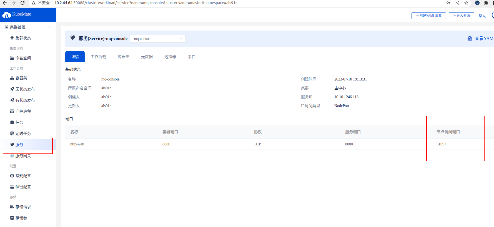

### 1. 前言

本部分主要基于[[RocketMQ高可用部署方案]]的基础上，介绍K8S上的单DLedger集群部署方案。

### 2. 镜像构建

#### 2.1 nameserver镜像构建

Dockerfile文件内容如下，参考文件`Dockerfile-namesrv`：
```Dockerfile
FROM openjdk/linux/amd64/openjdk:11.0.13
MAINTAINER yhma@amarsoft.com
ADD rocketmq-4.9.3 /rocketmq
expose 9876
ENV JAVA_OPT " -Xms512m -Xmx512m "
ENV JAVA_OPT_EXT " --add-opens java.base/jdk.internal.misc=ALL-UNNAMED "
CMD ["/bin/sh","-c","/rocketmq/bin/mqnamesrv"]
```
开始构建：
```shell
docker build -t harbor.amarsoft.com/rd-zhxd/als/rocketmq-namesrv:4.9.3 .
```

#### 2.2 broker镜像构建

Dockerfile文件内容如下，参考文件`Dockerfile`：
```Dockerfile
FROM openjdk/linux/amd64/openjdk:11.0.13  
MAINTAINER yhma@amarsoft.com  
ADD rocketmq-4.9.3 /rocketmq  
expose 30909 30911 40911
RUN mkdir /data
ENV JAVA_OPT " -Xms2g -Xmx2g "  
ENV JAVA_OPT_EXT " --add-opens java.base/jdk.internal.misc=ALL-UNNAMED --add-exports java.base/jdk.internal.ref=ALL-UNNAMED "  
CMD exec /rocketmq/bin/mqbroker -c /conf/${HOSTNAME}.conf
```
构建镜像前请删除rocketmq-4.9.3/bin/runbroker.sh中的内存配置：
```properties
## 修改前
JAVA_OPT="${JAVA_OPT} -server -Xms8g -Xmx8g"
## 修改后
JAVA_OPT="${JAVA_OPT} -server "
```
开始构建：
```shell
docker build -t harbor.amarsoft.com/rd-zhxd/als/rocketmq-broker:4.9.3 .
```

#### 2.3 console镜像构建

Dockerfile文件内容如下，参考文件`Dockerfile-console`：
```Dockerfile
FROM harbor.amarsoft.com/rd-zhxd/als/als9/jdk:8u201
MAINTAINER yhma@amarsoft.com
ADD rocketmq-console-ng-1.0.1.jar /app.jar
ENV server.port 8080
ENV JAVA_OPT " -Xms256m -Xmx512m "
CMD exec java ${JAVA_OPT} -jar app.jar
```
<font color="#ff0000">注意：rocketmq-console不支持jdk11，故使用jdk8作为基础镜像。</font>

开始构建：
```shell
docker build -t harbor.amarsoft.com/rd-zhxd/als/rocketmq-console:1.0.1 -f Dockerfile-console .
```


### 3. 准备broker配置文件

配置文件需要准备3份，分别为broker-0.conf、broker-1.conf 和 broker-2.conf。

broker-0.conf
```properties
brokerClusterName = RaftCluster
brokerName=beijing@broker
listenPort=30911
# nameserver地址，多个地址以;分隔，k8s环境下配置为对应的svc端口
namesrvAddr=namesrv-0.mqnamesrv-headless:9876;namesrv-1.mqnamesrv-headless:9876
storePathRootDir=/data/rmqstore/node
storePathCommitLog=/data/rmqstore/node/commitlog
enableDLegerCommitLog=true
dLegerGroup=beijing@broker
dLegerPeers=n0-broker-0.mqbroker-svc:40911;n1-broker-1.mqbroker-svc:40911;n2-broker-2.mqbroker-svc:40911
## must be unique
dLegerSelfId=n0
sendMessageThreadPoolNums=16
```

broker-1.conf
```properties
brokerClusterName = RaftCluster
brokerName=beijing@broker
listenPort=30911
# nameserver地址，多个地址以;分隔，k8s环境下配置为对应的svc端口
namesrvAddr=namesrv-0.mqnamesrv-headless:9876;namesrv-1.mqnamesrv-headless:9876
storePathRootDir=/data/rmqstore/node
storePathCommitLog=/data/rmqstore/node/commitlog
enableDLegerCommitLog=true
dLegerGroup=beijing@broker
dLegerPeers=n0-broker-0.mqbroker-svc:40911;n1-broker-1.mqbroker-svc:40911;n2-broker-2.mqbroker-svc:40911
## must be unique
dLegerSelfId=n1
sendMessageThreadPoolNums=16
```

broker-0.conf
```properties
brokerClusterName = RaftCluster
brokerName=beijing@broker
listenPort=30911
# nameserver地址，多个地址以;分隔，k8s环境下配置为对应的svc端口
namesrvAddr=namesrv-0.mqnamesrv-headless:9876;namesrv-1.mqnamesrv-headless:9876
storePathRootDir=/data/rmqstore/node
storePathCommitLog=/data/rmqstore/node/commitlog
enableDLegerCommitLog=true
dLegerGroup=beijing@broker
dLegerPeers=n0-broker-0.mqbroker-headless:40911;n1-broker-1.mqbroker-headless:40911;n2-broker-2.mqbroker-headless:40911
## must be unique
dLegerSelfId=n2
sendMessageThreadPoolNums=16
```

配置完毕后，将3份配置文件放到k8s平台ConfigMap里。

### 4. K8S上部署应用

#### 4.1 部署文件准备

部署文件内容如下所示，具体参见文件`rocketmq-deploy.yaml`：
```yaml
apiVersion: v1
kind: ConfigMap
metadata:
  name: mq-broker
  namespace: als91c
data:
  broker-0.conf: |-
    brokerClusterName = RaftCluster
    brokerName=beijing@broker
    listenPort=30911
    # nameserver地址，多个地址以;分隔，k8s环境下配置为对应的svc端口
    namesrvAddr=namesrv-0.mqnamesrv-headless:9876;namesrv-1.mqnamesrv-headless:9876
    storePathRootDir=/data/rmqstore/node
    storePathCommitLog=/data/rmqstore/node/commitlog
    enableDLegerCommitLog=true
    dLegerGroup=beijing@broker
    dLegerPeers=n0-broker-0.mqbroker-headless:40911;n1-broker-1.mqbroker-headless:40911;n2-broker-2.mqbroker-headless:40911
    ## must be unique
    dLegerSelfId=n0
    sendMessageThreadPoolNums=16
  broker-1.conf: |-
    brokerClusterName = RaftCluster
    brokerName=beijing@broker
    listenPort=30911
    # nameserver地址，多个地址以;分隔，k8s环境下配置为对应的svc端口
    namesrvAddr=namesrv-0.mqnamesrv-headless:9876;namesrv-1.mqnamesrv-headless:9876
    storePathRootDir=/data/rmqstore/node
    storePathCommitLog=/data/rmqstore/node/commitlog
    enableDLegerCommitLog=true
    dLegerGroup=beijing@broker
    dLegerPeers=n0-broker-0.mqbroker-headless:40911;n1-broker-1.mqbroker-headless:40911;n2-broker-2.mqbroker-headless:40911
    ## must be unique
    dLegerSelfId=n1
    sendMessageThreadPoolNums=16
  broker-2.conf: |-
    brokerClusterName = RaftCluster
    brokerName=beijing@broker
    listenPort=30911
    # nameserver地址，多个地址以;分隔，k8s环境下配置为对应的svc端口
    namesrvAddr=namesrv-0.mqnamesrv-headless:9876;namesrv-1.mqnamesrv-headless:9876
    storePathRootDir=/data/rmqstore/node
    storePathCommitLog=/data/rmqstore/node/commitlog
    enableDLegerCommitLog=true
    dLegerGroup=beijing@broker
    dLegerPeers=n0-broker-0.mqbroker-headless:40911;n1-broker-1.mqbroker-headless:40911;n2-broker-2.mqbroker-headless:40911
    ## must be unique
    dLegerSelfId=n2
    sendMessageThreadPoolNums=16
---

apiVersion: v1
kind: Service
metadata:
  labels:
    app: broker
  name: mqbroker-headless
  namespace: als91c
spec:
  type: ClusterIP
  clusterIP: None
  clusterIPs:
  - None
  ports:
  - name: tcp-30909
    port: 30909
    protocol: TCP
    targetPort: 30909
  - name: tcp-30911
    port: 30911
    protocol: TCP
    targetPort: 30911
  - name: tcp-40911
    port: 40911
    protocol: TCP
    targetPort: 40911
  selector:
    app: broker
  sessionAffinity: None
status:
  loadBalancer: {}
---

apiVersion: v1
kind: Service
metadata:
  labels:
    app: namesrv
  name: mqnamesrv-headless
  namespace: als91c
spec:
  type: ClusterIP
  clusterIP: None
  clusterIPs:
  - None
  ports:
  - name: http-web
    port: 9876
    protocol: TCP
    targetPort: 9876
  selector:
    app: namesrv
  sessionAffinity: None
status:
  loadBalancer: {}
---

apiVersion: v1
kind: Service
metadata:
  annotations:
    kubemate.io/creator: als91c
  name: mq-console
  namespace: als91c
spec:
  type: NodePort
  clusterIP: 10.101.246.113
  clusterIPs:
  - 10.101.246.113
  externalTrafficPolicy: Cluster
  internalTrafficPolicy: Cluster
  ipFamilies:
  - IPv4
  ipFamilyPolicy: SingleStack
  ports:
  - name: http-web
    port: 8080
    protocol: TCP
    targetPort: 8080
  selector:
    app: mq-console
  sessionAffinity: None
status:
  loadBalancer: {}
---

apiVersion: apps/v1
kind: StatefulSet
metadata:
  annotations:
    kubemate.io/creator: als91c
    kubemate.io/description: RocketMQ Broker
    kubemate.io/updator: als91c
  labels:
    app: broker
  name: broker
  namespace: als91c
spec:
  podManagementPolicy: OrderedReady
  replicas: 3
  selector:
    matchLabels:
      app: broker
  serviceName: 'mqbroker-headless'
  template:
    metadata:
      labels:
        app: broker
    spec:
      containers:
      - image: harbor.amarsoft.com/rd-zhxd/als/rocketmq-broker:4.9.3
        imagePullPolicy: Always
        name: container-vzqnna
        ports:
        - containerPort: 30909
          name: tcp-30909
          protocol: TCP
        - containerPort: 30911
          name: tcp-30911
          protocol: TCP
        - containerPort: 40911
          name: tcp-40911
          protocol: TCP
        resources:
          limits:
            cpu: 500m
            memory: 3Gi
          requests:
            cpu: 50m
            memory: 500Mi
        terminationMessagePath: /dev/termination-log
        terminationMessagePolicy: File
        volumeMounts:
        - mountPath: /etc/localtime
          name: host-local-time
          readOnly: true
        - mountPath: /data/rmqstore
          name: broker-store
        - mountPath: /conf
          name: volume-rvjtp6
          readOnly: true
      dnsPolicy: ClusterFirst
      imagePullSecrets:
      - name: harbor
      restartPolicy: Always
      schedulerName: default-scheduler
      securityContext: {}
      serviceAccount: default
      serviceAccountName: default
      terminationGracePeriodSeconds: 30
      volumes:
      - hostPath:
          type: ''
          path: /etc/localtime
        name: host-local-time
      - configMap:
          defaultMode: 420
          name: mq-broker
        name: volume-rvjtp6
  updateStrategy:
    type: RollingUpdate
  volumeClaimTemplates:
  - apiVersion: v1
    kind: PersistentVolumeClaim
    metadata:
      name: broker-store
      namespace: als91c
    spec:
      accessModes:
      - ReadWriteOnce
      resources:
        requests:
          storage: '10'
      storageClassName: managed-nfs-storage
      volumeMode: Filesystem

---
apiVersion: apps/v1
kind: StatefulSet
metadata:
  annotations:
    kubemate.io/creator: als91c
    kubemate.io/description: RocketMQ Nameserver
    kubemate.io/updator: als91c
  labels:
    app: namesrv
  name: namesrv
  namespace: als91c
spec:
  podManagementPolicy: OrderedReady
  replicas: 2
  selector:
    matchLabels:
      app: namesrv
  serviceName: 'mqnamesrv-headless'
  template:
    metadata:
      annotations:
        amarsoft.kubemate/restartAt: 2023/07/10 20:14:07
        kubemate.io/creator: als91c
        kubemate.io/description: RocketMQ Nameserver
        kubemate.io/updator: als91c
      labels:
        app: namesrv
    spec:
      containers:
      - image: harbor.amarsoft.com/rd-zhxd/als/rocketmq-namesrv:4.9.3
        imagePullPolicy: Always
        name: container-vkzb37
        ports:
        - containerPort: 9876
          name: http-web
          protocol: TCP
        resources:
          limits:
            cpu: 500m
            memory: 1Gi
          requests:
            cpu: 50m
            memory: 500Mi
        terminationMessagePath: /dev/termination-log
        terminationMessagePolicy: File
        volumeMounts:
        - mountPath: /etc/localtime
          name: host-local-time
          readOnly: true
      dnsPolicy: ClusterFirst
      imagePullSecrets:
      - name: harbor
      restartPolicy: Always
      schedulerName: default-scheduler
      securityContext: {}
      serviceAccount: default
      serviceAccountName: default
      terminationGracePeriodSeconds: 30
      volumes:
      - hostPath:
          type: ''
          path: /etc/localtime
        name: host-local-time
  updateStrategy:
    type: RollingUpdate
---

apiVersion: apps/v1
kind: Deployment
metadata:
  annotations:
    kubemate.io/creator: als91c
    kubemate.io/updator: als91c
  labels:
    app: mq-console
  name: mq-console
  namespace: als91c
spec:
  progressDeadlineSeconds: 600
  replicas: 1
  revisionHistoryLimit: 10
  selector:
    matchLabels:
      app: mq-console
  strategy:
    type: RollingUpdate
    rollingUpdate:
      maxSurge: 25%
      maxUnavailable: 25%
  template:
    metadata:
      annotations:
        kubemate.io/creator: als91c
      labels:
        app: mq-console
    spec:
      containers:
      - env:
        - name: rocketmq.config.namesrvAddr
          value: mqnamesrv-headless:9876
        image: harbor.amarsoft.com/rd-zhxd/als/rocketmq-console:1.0.1
        imagePullPolicy: Always
        name: container-pjdcoq
        ports:
        - containerPort: 8080
          name: http-web
          protocol: TCP
        resources:
          limits:
            cpu: 500m
            memory: 1Gi
          requests:
            cpu: 50m
            memory: 500Mi
        terminationMessagePath: /dev/termination-log
        terminationMessagePolicy: File
        volumeMounts:
        - mountPath: /etc/localtime
          name: host-local-time
          readOnly: true
      dnsPolicy: ClusterFirst
      imagePullSecrets:
      - name: harbor
      restartPolicy: Always
      schedulerName: default-scheduler
      securityContext: {}
      serviceAccount: default
      serviceAccountName: default
      terminationGracePeriodSeconds: 30
      volumes:
      - hostPath:
          type: ''
          path: /etc/localtime
        name: host-local-time


```

<font color="#ff0000">部署时请自行修改文件中namespace以及镜像地址。</font>

#### 4.2 部署应用

复制部署文件到K8S主节点，执行命令：
```shell
kubectl apply -f rocketmq-deploy.yaml
```

#### 4.3 验证安装

在kubemate中找到mq-console对应的服务：


通过NodePort访问控制台，如图所示，访问地址为：http://10.2.64.64:31097
